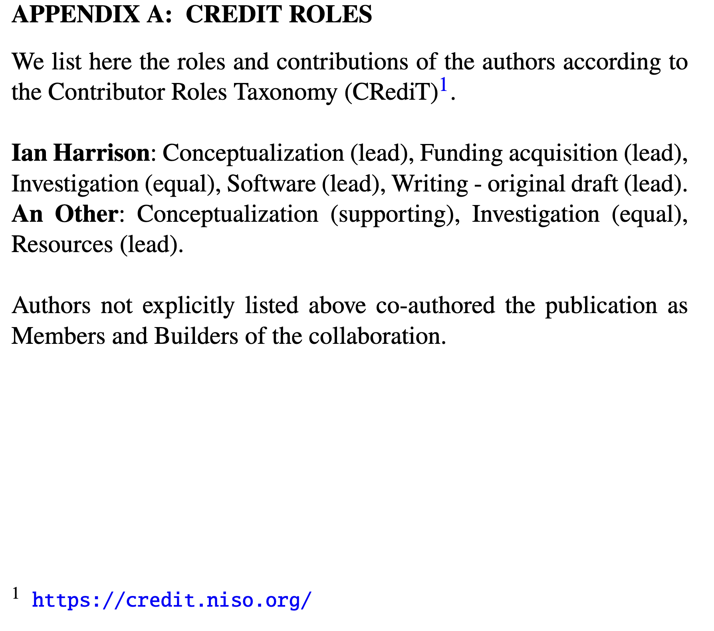

# credit2latex
Python script for converting CRediT tables to LaTeX

Creates LaTeX which looks like this:

from a CRediT spreadsheet. Note the pre and post-amble may not be the appropriate wording for you and your collaboration!
## Steps
1. Create a copy of the spreadsheet [here](https://docs.google.com/spreadsheets/d/1tkFh8s6L32oV52Wc_VbeHUdQpAJzduivrjyxmhN3YmM/edit?usp=sharing) and fill it in for the relevant authors.
2. Download the spreadsheet as a `.csv`
3. Edit the csv to remove unused rows including comments (sorry about this step, if anyone knows the way to do this with `astropy.Table` please open a PR)
3. Run a version of the python script, pointing it at the `.csv` e.g. `python credit_csv_to_tex.py example/Example\ CRediT\ template\ -\ Sheet1.csv`
4. The script with generate a `.tex` file with the CRediT roles and an appropriate pre and post-amble for use as an Appendix.
